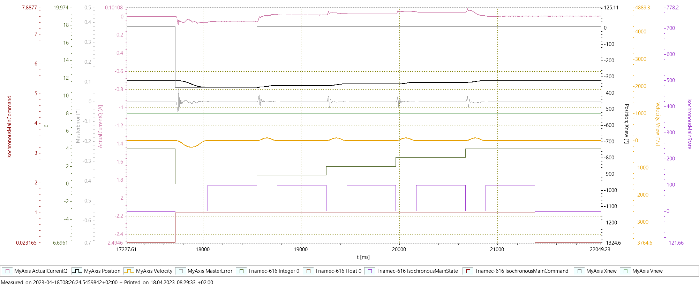

# Step Moves Example with Tama

This *Tama* program example can be used to run step moves in positive or negative direction, by configuring a few parameters. Common applications for this are:

- Measuring axis compensation tables
- Move and settle analysis

The following screenshot shows a step moves procedure, with a start position at -365°, 4 subsequent steps of 10°, waiting 500ms after each move.

## Parameters

The following parameters are configurable in `Register.Application.Parameters`:

| Register      | Description                                         |
| ------------- | --------------------------------------------------- |
| `Integers[0]` | Wait time between steps in 10kHz counts, 10000 = 1s |
| `Integers[1]` | Step count                                          |
| `Floats[0]`   | Step size in axis units                             |
| `Floats[1]`   | Step velocity in axis units                         |
| `Floats[2]`   | Start position for positive steps procedure         |
| `Floats[3]`   | Start position for negative steps procedure         |

## Commands

The following commands are implemented and can be set in `Register.Application.TamaControl.IsochronousMainCommand`. The command resets to *None* automatically, after finishing a commanded procedure.

| Command                    | Value | Description                                             |
| -------------------------- | ----- | ------------------------------------------------------- |
| None                       | 0     | No action                                               |
| MeasurePositive            | 1     | Run steps procedure in positive direction               |
| MeasureNegative            | 2     | Run steps procedure in negative direction               |
| MeasurePositiveAndNegative | 3     | Run steps procedure in both directions (positive first) |

## Signals

`Register.Application.Variables.Integers[0]` indicates the current step index.

`Register.Application.TamaControl.IsochronousMainState` indicates the current procedure state.

| State           | Value | Description                                   |
| --------------- | ----- | --------------------------------------------- |
| Idle            | 0     | No action                                     |
| WorkingPositive | 1     | Running steps procedure in positive direction |
| WorkingNegative | 2     | Running steps procedure in negative direction |

A Scope template `Template_TamScope_StepMoves.TAMsco` is available in this repository, to plot and debug the procedure. The image above is recorded with this template.
